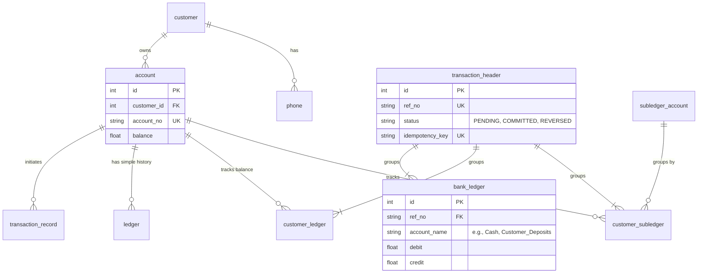

# Banking Web Application

A full-featured banking web application prototype built with **Python**, **Streamlit**, and **SQLite**. This project demonstrates advanced core banking operations including a double-entry ledger system, automated NUBAN account generation, Nigerian banking standards, and a comprehensive administrative dashboard.

## Features

### Core Banking & Nigerian Standards
- **NUBAN Account Generation:** Automatically assigns a valid 10-digit NUBAN account number upon user registration.
- **Secure Authentication:** User accounts are protected using industry-standard `bcrypt` password hashing with automatically generated salts.

### Financial Engineering & Backend Architecture
- **Transaction State Machine:** Transactions are processed through strict states (`PENDING` -> `COMMITTED` -> `REVERSED`).
- **Database-Level Validations:** The SQLite database utilizes rigorous `TRIGGER` constraints. At the exact moment a transaction attempts to commit, the database calculates `SUM(debit) - SUM(credit)`. If the ledger is not perfectly balanced (zero), the database forcefully issues an `ABORT` and rolls back the transaction. This guarantees it is mathematically impossible to record an unbalanced entry regardless of application-level bugs.
- **Idempotency Keys (Double-Charge Protection):** Implements unique UUID idempotency keys passed from the frontend session state. This ensures that network latency or double-clicks do not result in duplicate ledger entries or double charges.
- **Structured Audit Logging:** Utilizes Python's native `logging` library to maintain a precise, structured audit trail (`bank_app.log`) of every transaction attempt, success, and failure for observability.

### Transactions & Accounting
- **Double-Entry Ledger:** Every transaction (Deposit, Withdrawal, Transfer, Airtime, Bills) automatically creates balanced debit and credit entries across underlying subledger accounts (e.g., Cash, Customer Deposits, Airtime Payable).
- **Fund Transfers:** Supports both internal transfers to other users and external transfers.
- **Transaction History & Ledger:** Users can view a simplified transaction history as well as a detailed, professional customer ledger showing every accounting entry.

### Administrative Dashboard
An exclusive admin panel (accessible by logging in as `admin@gmail.com`) providing oversight:
- **Global Trial Balance:** Ensures debits and credits across the entire bank are perfectly balanced.
- **Subledgers View:** View balances for all bank internal accounts (Cash, Equity, Revenue, Interbank Payables, etc.).

## Database Schema (ERD)

The core architecture revolves around separating customer accounts from the double-entry accounting ledgers.



## Tech Stack & Architecture Decisions

| Component | Technology |
|-----------|------------|
| Language  | Python 3 |
| Frontend  | Streamlit |
| Database  | SQLite (built-in) |
| Data manipulation | Pandas |

**Why SQLite?**
While enterprise financial systems typically rely on robust RDBMS engines like PostgreSQL or Oracle, **SQLite** was intentionally chosen for this specific prototype. It demonstrates the ability to implement rigorous financial constraints (like `BEFORE UPDATE` triggers, transaction state machines, and relational integrity) entirely within a lightweight, zero-configuration environment. This makes the prototype instantly deployable on ephemeral cloud environments (like Streamlit Community Cloud) without requiring readers or recruiters to provision external database servers just to test the application's underlying logic.

## Getting Started

### Prerequisites

- **Python 3.8+** installed on your machine
- Required Python libraries: `streamlit`, `pandas`

### Installation

1. **Clone the repository**
   ```bash
   git clone https://github.com/Daveokw/Bank-App.git
   cd Bank-App
   ```

2. **Install dependencies**
   ```bash
   pip install -r requirements.txt
   ```

3. **Run the application**
   ```bash
   streamlit run app.py
   ```

   That's it! The SQLite database (`bank_app.db`) will be created automatically on the first run.

## Automated Keep-Alive
This repository includes a built-in GitHub Actions workflow (`.github/workflows/keep_alive.yml`) powered by Playwright to automatically prevent the application from sleeping when deployed on Streamlit Community Cloud.

## Notes
- This is an **advanced portfolio project** designed to showcase backend logic, double-entry accounting principles, and responsive Python web development.
- **Auto-Reset:** Because this is a demonstration prototype designed to be kept alive indefinitely in the cloud, the database is programmed to **automatically reset every 24 hours** in the background. The automated GitHub Actions keep-alive script seamlessly triggers this cycle behind the scenes, ensuring a completely fresh testing environment each day. As a safety fallback, if a user happens to be actively exploring the app at the exact moment the 24-hour timer expires, they are safely redirected to the login screen to prevent data conflicts.
- The `bank_app.db` file is generated locally and ignored by Git. If deployed, the database is recreated fresh in the cloud environment.

## License
This project is open source and available for educational and portfolio purposes.
