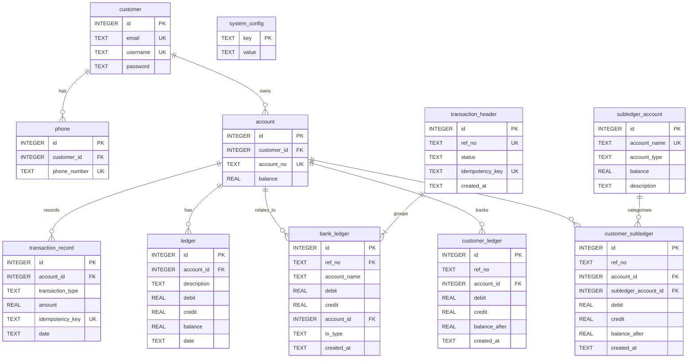

# DAVE Bank

A Streamlit and SQLite banking demonstration built around atomic transactions, idempotency controls, customer ledgers, and double-entry accounting.

[Open the live application](https://dbank-app.streamlit.app/)

## What the application demonstrates

- Customer registration and bcrypt password hashing
- NUBAN-style 10-digit demonstration account numbers
- Deposits, withdrawals, internal and external transfers, airtime, and bills
- Idempotency keys that prevent repeated form submissions from charging twice
- Atomic SQLite transactions with foreign keys, write locking, and rollback on failure
- Balanced journal validation before a transaction can be committed
- Customer transaction history, account ledger, and subledger records
- Administrative trial balance, subledger inspection, customer subledger, and reconciliation views
- Automatic demonstration-data refresh after 24 hours

This is a portfolio demonstration. It does not connect to a payment network, hold funds, or provide real banking services.

## Architecture

GitHub renders the ERD below automatically. Its reusable Mermaid source is also available in [`docs/erd.mmd`](docs/erd.mmd); paste that file into [Mermaid Live](https://mermaid.live/) to export an SVG or PNG.


```mermaid
erDiagram
    customer ||--o{ phone : has
    customer ||--o{ account : owns
    account ||--o{ transaction_record : records
    account ||--o{ ledger : has
    account ||--o{ bank_ledger : relates_to
    account ||--o{ customer_ledger : tracks
    account ||--o{ customer_subledger : tracks
    transaction_header ||--|{ bank_ledger : groups
    subledger_account ||--o{ customer_subledger : categorises

    customer {
        INTEGER id PK
        TEXT email UK
        TEXT username UK
        TEXT password
    }
    phone {
        INTEGER id PK
        INTEGER customer_id FK
        TEXT phone_number UK
    }
    account {
        INTEGER id PK
        INTEGER customer_id FK
        TEXT account_no UK
        REAL balance
    }
    transaction_record {
        INTEGER id PK
        INTEGER account_id FK
        TEXT transaction_type
        REAL amount
        TEXT idempotency_key UK
        TEXT date
    }
    transaction_header {
        INTEGER id PK
        TEXT ref_no UK
        TEXT status
        TEXT idempotency_key UK
        TEXT created_at
    }
    ledger {
        INTEGER id PK
        INTEGER account_id FK
        TEXT description
        REAL debit
        REAL credit
        REAL balance
        TEXT date
    }
    bank_ledger {
        INTEGER id PK
        TEXT ref_no FK
        TEXT account_name
        REAL debit
        REAL credit
        INTEGER account_id FK
        TEXT tx_type
        TEXT created_at
    }
    customer_ledger {
        INTEGER id PK
        TEXT ref_no
        INTEGER account_id FK
        REAL debit
        REAL credit
        REAL balance_after
        TEXT created_at
    }
    subledger_account {
        INTEGER id PK
        TEXT account_name UK
        TEXT account_type
        REAL balance
        TEXT description
    }
    customer_subledger {
        INTEGER id PK
        TEXT ref_no
        INTEGER account_id FK
        INTEGER subledger_account_id FK
        REAL debit
        REAL credit
        REAL balance_after
        TEXT created_at
    }
    system_config {
        TEXT key PK
        TEXT value
    }
```

## Run locally

Python 3.11 or later is recommended.

```bash
git clone https://github.com/Daveokw/Bank-App.git
cd Bank-App
python -m venv .venv
```

Activate the environment, then install and run the application:

```bash
python -m pip install -r requirements.txt
streamlit run app.py
```

The SQLite database is created on first use and is excluded from Git.

## Administrative access

Administrative access is disabled unless a password is configured. For local development, create `.streamlit/secrets.toml`:

```toml
BANK_ADMIN_PASSWORD = "replace-with-a-strong-password"
```

The password must contain 12–72 bytes. Sign in with `admin@gmail.com` and the configured password. On Streamlit Community Cloud, add the same key through the application's Secrets settings instead of committing it.

## Validation

```bash
python -m unittest discover -s tests -v
python -m py_compile app.py db.py engine.py screens.py
```

## Streamlit deployment

Deploy `app.py` from the repository root. Python dependencies are declared in `requirements.txt`; no Linux system packages are required.

The GitHub Actions availability workflow checks the deployed interface every four hours at an off-peak minute. It can wake a sleeping app and fails if the real DAVE Bank interface does not load. GitHub schedules are best-effort, so this reduces—but cannot eliminate—the possibility of Community Cloud hibernation.

## Data and security limitations

- SQLite storage on Streamlit Community Cloud is ephemeral and is not suitable for production banking data.
- The database is refreshed on the first application run after it becomes 24 hours old; it is not a background job.
- Monetary inputs are normalised to two decimal places, but this prototype retains SQLite `REAL` columns for compatibility. Production systems should store integer minor units or use a database-native fixed-precision decimal type.
- Authentication and accounting controls are demonstrations and have not undergone a formal security or financial audit.
